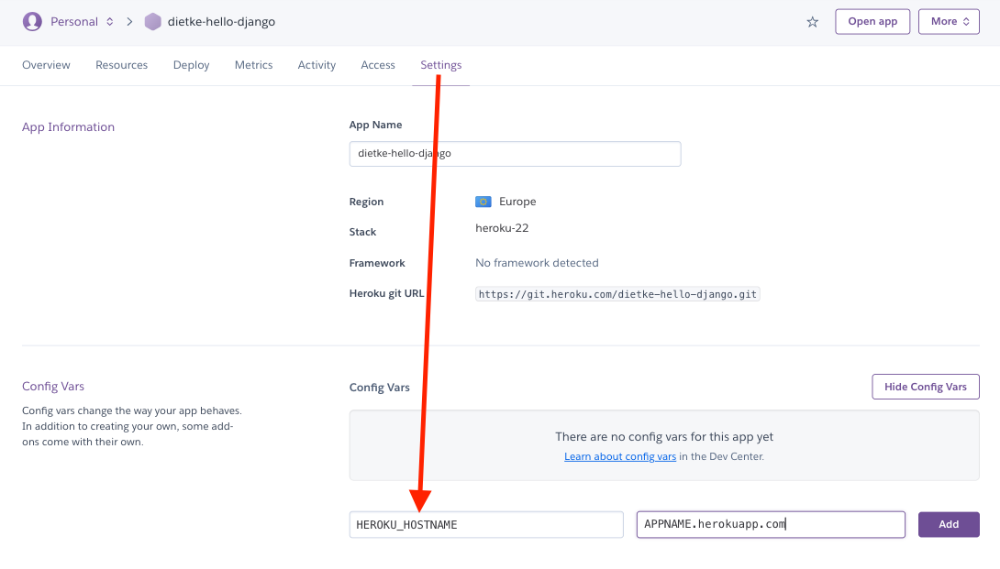

# Deployment

- The app was deployed to [HEROKU](https://heroku.com/).
- The database was deployed to [ElephantSQL](https://www.elephantsql.com/).

- The app can be opened [here](https://bark-buddies-f5470c68ef42.herokuapp.com/).

## Local deployment

*Note:*

- This project requires to install all the requirements:
- Open the terminal window and type:
- `pip3 install -r requirements.txt`

Create a local copy of the GitHub repository by following one of the two processes below:

- Download ZIP file:
  1. Visit the [GitHub Repository](https://github.com/DietkeSt/bark-buddies).
  1. Click the Code button and download the ZIP file containing the project.
  1. Extract the ZIP file to a location on your PC.

- Clone the repository:
  1. Open a folder on your computer with the terminal.
  1. Run the following command
  - `git clone https://github.com/DietkeSt/bark-buddies.git`

---

1. Install the dependencies:

    - Open the terminal window and type:
    - `pip3 install -r requirements.txt`

2. Create a `.gitignore` file in the root directory of the project where you should add env.py and __pycache__ files to prevent the privacy of your secret data.

3. Create a `.env` file. This will contain the following environment variables:

    ```python
    import os

      os.environ['SECRET_KEY'] = 'Add a secret key'
      os.environ['DATABASE_URL'] = 'will be used to connect to the database'
      os.environ['DEBUG'] = 'True'
    ```

    *During the development stage DEBUG is set to True, but it is vital to change it to False.*

4. Run the following commands in a terminal to make migrations:
    - `python3 manage.py makemigrations`
    - `python3 manage.py migrate`
5. Create a superuser to get access to the admin environment.
    - `python3 manage.py createsuperuser`
    - Enter the required information (your username, email and password).
6. Run the app with the following command in the terminal:
    - `python3 manage.py runserver`
1. Open the link provided in a browser to see the app.

2. If you need to access the admin page:
    - Add /admin/ to the link provided.
    - Enter your username and password (for the superuser that you have created before).
    - You will be redirected to the admin page.

## Heroku Deployment

- In [Heroku](https://heroku.com): Create an account
  


- In the Terminal:

    | action | terminal command | comment |
    | ------ | ---------------- | ------- |
    | login to your heroku account | `heroku login -i` | |
    | install Postgres | `pip3 install psycopg2-binary` | Postgres is important for your content to talk to the database and back end.|
    | install webserver | `pip3 install gunicorn` | Replaces the development server once the app is deployed to Heroku |
    | create a requirements file | `pip3 freeze --local > requirements.txt` | Creates a file to let heroku know which packages to install |
    | create app | `heroku apps:create APPNAME --region eu` | Give your app name a unique value e.g. APPNAME = barkbuddies |
    | view key remotes | `git remote -v` | |

### Create Database on ElephantSQL

1. Go to [ElephantSQL](https://www.elephantsql.com/) and create a new account.

2. Create a new instance of the database.

3. Select a name for your database and select the free plan. Then select Region.

    

4. Select a region close to you.

5. Click "Review"

6. Click "Create Instance"

7. Click on the name of your database to open the dashboard.

    

8. You will see the dashboard of your database. You will need the URL of your database to connect it to your Django project.

    


### Connecting Database with Heroku

- Open your App in Heroku

- Open the settings tab

- Click Reveal Config Vars

- Add a Config Var called DATABASE_URL

**Note:** *The value should be the ElephantSQL database url you copied in the previous step*

- In the Terminal:

    | action | terminal command | comment |
    | ------ | ---------------- | ------- |
    | install a database url package | `pip3 install dj-database-url` | |
    | refreeze the requirements file | `pip3 freeze --local > requirements.txt` | |
    | get the url of the remote database | `heroku config` | Displays the DATABASE_URL Config Var we just set on Heroku in the terminal. |
    

- In your project's *settings.py*:

#### Comment out the original DATABASE settings:

    # DATABASES = { 'default': {
        # 'ENGINE': 'django.db.backends.sqlite3'
        # 'NAME': BASE_DIR / 'db.sqlite3'
        # }
    # }

#### Copy and Paste the DATABASE settings:

    DATABASES = { 
        'default': dj_database_url.parse('postgres://DATABASE_URL')
    }

#### Import dj_database_url

    from pathlib import Path
    import dj_database_ur

*Note: Import at top of settings.py*

- In the Terminal:
     | action | terminal command | comment |
    | ------ | ---------------- | ------- |
    | Run your migrations | `python3 manage.py migrate` | |
    
### Pushing Changes to Github

- In the IDE file explorer or terminal:

1. Create a new file, .gitignore.

    `django_todo / .gitignore`

2. Add files you want to ignore.

    `*.sqlite3`
    
    `__pycache__/`

3. Add your files to the local git repo.
   
    `git add .`
    
4. Commit the files.
    
    `git commit -m “prepared to deploy to Heroku”`

5. Push to remote repo.
   
    `git push origin main`

__Initial Deployment__

- In the Terminal:
     | action | terminal command | comment |
    | ------ | ---------------- | ------- |
    | Deploy app to Heroku | `git push heroku main` | If you get an error try ‘git push heroku master’ |
    | Deploy app to Heroku | `git push origin main` | |

- In the IDE:
  - Create a Procfile.
  - Add gunicorn to Procfile:
    
    `web: gunicorn django_todo.wsgi:application`

- In the Terminal:
     | action | terminal command | comment |
    | ------ | ---------------- | ------- |
    | Add the Procfile to the git Repo | `git add Procfile` | |
    | Commit | `git commit -m “Added Procfile”` | |
    | Push to heroku | `git push origin main` | |

- In Heroku:
  
  1. Click 'Open App'

    

  2. Copy the url
  
  **Note:** *You will see an Application error.*
  

- In your project's *settings.py*:
  
  1. Paste in the url to ALLOWED_HOSTS value.
   `ALLOWED_HOSTS = ['APP_NAME.herokuapp.com']`
   
- In the Terminal:

    | action | terminal command | comment |
    | ------ | ---------------- | ------- |
    | Add settings.py file to local git repo | `git add django_todo/settings.py` | |
    | Commit | `git commit -m “Fixed Allowed_hosts”` | |
    | Push to heroku | `git push heroku main` | |
    | Push to GitHub repo | `git push origin main` | |

### Connecting Heroku to Github

- In settings.py:
  - Add import os to settings.py:
  
    `import os`

- In Heroku:
  1. Open your app.
  2. Open Deploy tab.
  3. Select a Deployment Method option.

  4. Search for the Repo Name and Connect.

  5. Enable Automatic Deploys.

- In settings.py:
  - Get the Secret Key value using an environment variable.

    `SECRET_KEY = os.environ.get('SECRET_KEY', '---secretkeyvalue---’)`
    
  - Replace the Heroku host value in ALLOWED_HOSTS.
  
    `ALLOWED_HOSTS = [os.environ.get('HEROKU_HOSTNAME')]`

  - Replace the Database URL value in DATABASES.
  
    `DATABASES = {
        'default': dj_database_url.parse(os.environ.get('DATABASE_URL'))
    }`

- In Heroku:
  1. Click the Settings tab.
  2. Click Reveal Config Vars.
  3. Add New Variable:
    
        `HEROKU_HOSTNAME`

        

### Create a Secret Key for Heroku

- In settings.py:
   - Replace the default SECRET KEY with a blank string

        `SECRET_KEY = os.environ.get('SECRET_KEY', '')`
        
- In your browser, open a Django Secret Key generator, for example the [miniwebtool](https://miniwebtool.com/django-secret-key-generator/) one.
  - Generate and copy a new Django Secret Key.
  - Add the key as a new environment variable to your IDE.
  - Restart the workspace.

- In Heroku:
  - Click on the Settings Tab
  - Reveal Config Variables
  - Create new variable, and paste the generated key as the Value:
  
    `SECRET_KEY`

    


__Final Deployment__

- Set debug to False locally + delete DISABLE_COLLECTSTATIC from config vars in Heroku dashboard.
- Commit and push the changes to GitHub.


---
