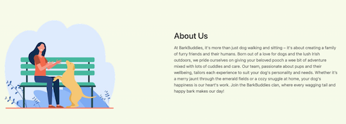
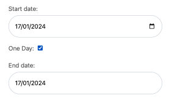

# BarkBuddies

## Features

Web application has the following pages:

- home page
- login page
- registration page
- logout page
- service detail page
- bookings page
- edit booking page

Web application has the following modals:

- review modal
- booking modal

### Access to pages according to the user role

| Page Name     | Pet Sitter (Admin)  | Registered User   |  Visitor    |
| ------------- | ------------- | ------------- | ------------- |
| home page                   | Y | Y | Y |
| login page                  | Y | Y | Y |
| registration page           | Y | Y | Y |
| logout page                 | Y | Y | N |
| service detail page         | Y | Y | Y |
| bookings page   | Y | Y | N |
| edit booking page           | Y | Y | N |
| admin page        | Y | N | N |
| review modal        | Y | Y (if past bookings are present) | N |
| booking modal        | Y | Y | N |

- Each page has a navbar and a footer

**Navbar**

Navbar has the following links:

- home
- about
- testimonials
- services -> direct links to each service
- admin (if logged in as admin)
- my bookings & logout button (if logged in)
- register & login button (if logged out)
  
    
  
- barkbuddies logo
  
    

The navbar is simple and to the point and the user focus is on the right hand sight, where the most account features are listed, login, logout, register and my bookings. The navbar's uncluttered design makes navigation intuitive for users. Whether new or returning, users can easily find what they need.

When the user clicks on the login button, they are navigated to the login page, and the user can login, or can register, if not done yet.

- 

When the user is logged in, the navbar looks as follows.

- 

It has the "My Bookings" buttons on the right side, which opens the My Bookings page.

- 

There is also the “Logout” button on the right, which opens the Logout Page.

- 

On the left you will find the Home, About and Testimonials links that lead to the different sections on the Home page:

- 

The Services lead to the Service Detail pages:

- 

And if an Admin is logged in, they can reach the Admin page via the Admin link. It will open in a new wind.

For the mobile version of the website, the navbar is displayed toggled and looks as follows when untoggled:

  

**Footer**

Footer has the following sections:

- About and Contact information on the left.
- Quick Links to Services, Testimonials and Bookings in the center.
- And Social Links on the right.
- Copyright and Information about the Coder with link to Github can be found on the bottom of the footer:

  

**Home page**

#### Hero

"Welcome to BarkBuddies" - This engaging section instantly captures the visitor's attention with its vibrant image and welcoming message. The 'Book a Service' button prominently displayed encourages quick user action to explore services.

- 

#### About

This section provides a warm, personal introduction to BarkBuddies. It emphasizes the Irish roots and the love for dogs, creating a connection with pet owners looking for trustworthy services.

- 

#### Services

Underneath, there is the Service section that lists a collection of all active services. Each service is presented in an individual card with essential details like price and a descriptive image. This layout provides a quick overview, allowing users to browse services effortlessly.

- 

#### Testimonials

Users can scroll through reviews in a dynamic slider, giving them insights into others' experiences and building trust in the services offered.

- 

The option to leave a review is visible after availing of a service. Users are encouraged to leave a review, fostering a sense of community and providing valuable feedback.

  

**Registration page**

  

This page has a sign up form displayed in a card design for a cohesive user design experience.

Should the user already have an account, there is also a direct link visible that leads the user to the login page.

  

Under the form's header, there are the following fields:

- Username (required for login and will be used for storing booking information)
- Email (optional)
- Password (to let the user log in)
- Password confirmation (to let the user log in)

If the user types an invalid password or username, they will see the appropriate notification:

  

**Login page**

  

This page has a login form displayed in a card design for a cohesive user design experience.

Should the user not have an account yet, there is also a direct link visible that leads the user to the Registration page.

  

Underneath, there are two fields which have to be filled out in order to log in:

- Username
- Password

If the user made a mistake in the username or password, the user will see an error message.

  

Under the fields, there is a button "Login" which leads to the home page after successful login.

**Logout page**

  

This page has a logout confirmation request form displayed in a card design for a cohesive user design experience.

It has the title "Logout" and the subtitle "Are you sure you want to logout?"
Underneath, there is a button "Logout".

**Service Detail page**

  

The Service Detail page displays one big Service card, with details about the service, such as a description, pricing and the option to book the service, making the process efficient and user-friendly.

Is the user logged in, they will see the ‘Book Now’ button that will open the booking modal for a smooth booking experience.

 

Underneath, the user will find the section that lists other services, so they can easily switch between services before deciding to book.

  

If the user is not logged in, the Book Now button is displayed as ‘Login to book Service’ to indicate the user needs to be registered and logged in to be able to book. Upon clicking on the button the user will be led to the login page and promptly redirected back to the Service Detail page after successful login.

  

**Bookings page**

  

Registered users can view and manage their bookings. This section provides a comprehensive view of upcoming, and cancelled bookings.

Each booking is displayed in a card and the users have several options to manage their bookings:

- Re-book
- Edit
- Cancel

This offers them flexibility and control over their bookings.

  

#### Re-Book Button

That button leads the user back to the Service Detail page to book the same service again.

#### Edit Button

This button leads the user to the Edit Booking page to adjust their booking, for example, they could change the date or time.

#### Cancel Button

This cancels the booking and highlights the card accordingly after. Once the booking is cancelled the user will have the option to Delete the booking as well.

 

#### Delete Button

That option completely removes the booking from their booking overview and will also remove it from the backend.

#### Leave a Review

The option to leave a review is visible after availing of a service. Users are encouraged to leave a review, fostering a sense of community and providing valuable feedback.

  

**Edit Booking Page**

  

This page displays a form that the user can use to edit their booking. This page has a box with an alert message informing the user about unavailability of the dog sitter.
Underneath, it features the following fields:

- Start Date
One Day
End Date
Time
Comments
Add Second Dog

The fields are prefilled with the current dates and time for the booking and the user can adjust whichever field they like.

Once adjusted the user will see the new price reflected in the total price before saving the changes.  

  

There are two buttons under the form fields. ‘Save Changes’ will save the changes according to the form settings and the user will receive a success notification.

 

When the user hits ‘Cancel’, they will be led back to their Bookings page.

**Review Modal**

This modal is only accessible for users who availed of a booking in the past. It allows them to leave a review which will be displayed in the home page slider after admin approval.
  

The modal displays the user name and the user can select a Service they want to review in the Service field. Then leave their comment in the body field.

Once they click submit a success notification appears, informing the user their comment will be reviewed.

  

The user can leave more reviews after submission, there is no limit. This makes sure that users can also review other services they booked, or add a new review, if they had a different experience. This is user-friendly as it is non-restrictive.

**Booking Modal**

Once a user selects a service, an easy-to-use booking modal appears. Users can choose dates, add special requests, and view the total cost upfront.

  

On top of the booking form, the user will see an alert message that displays any unavailability in the near future.

Underneath, the user can select a Start-Date, End-Date and a Time for the booking. If they only want to book one day, they have the option to add a Checkmark next to ‘One Day’ - this automatically sets the end date to the same day and saves the user a few clicks.

The comment box is optional and allows the user to add any special requests.

Underneath, there is the option to add a second dog with a clear indication of the additional cost. This adds flexibility and transparency to the booking process.

When everything is filled out, the user can either choose to use the ‘Book Now’ button, which confirms the booking and leads them to their Bookings overview. Or they click the ‘Close’ button to cancel the booking process and close the modal.

Additional features are that the Time selection will disable specific time slots that have already been booked before. This avoids double-booking and lets the user know in advance what times are available.

Should the user still choose a day that is unavailable, they will see a warning message, informing them that the date is not available for booking.

Each feature of the BarkBuddies website is thoughtfully designed to enhance user experience, emphasising ease of use, transparency, and engagement. Whether it's booking a service or reading reviews, users can navigate the website effortlessly and with confidence.

---
