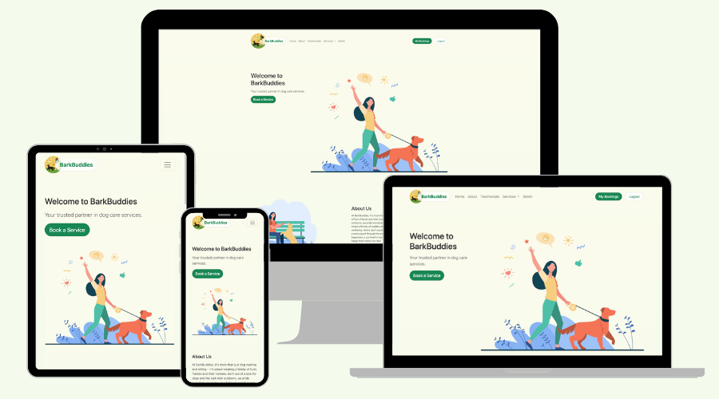
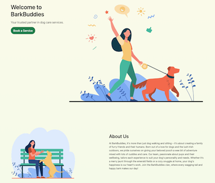
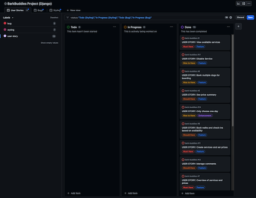
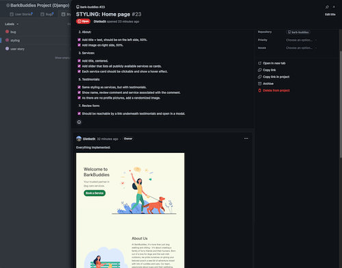
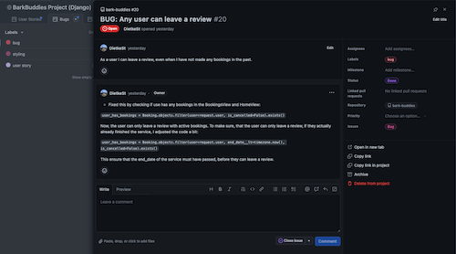
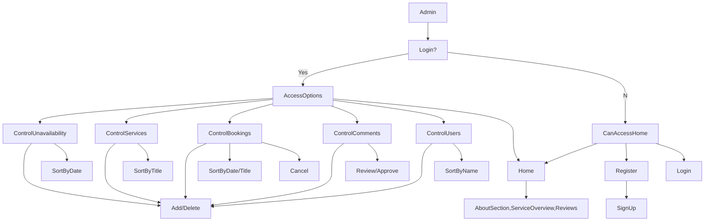
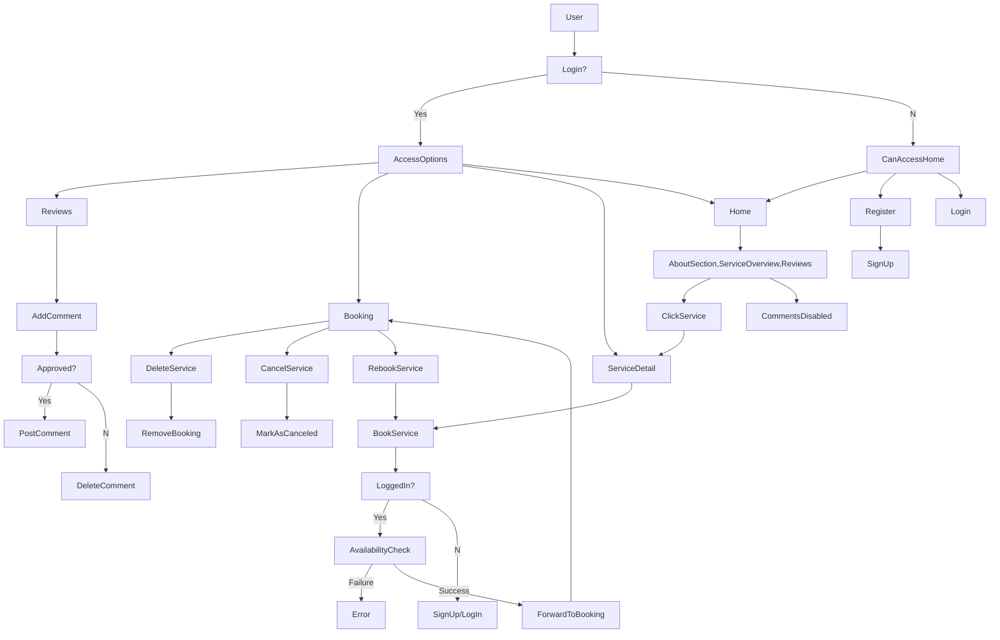

# BarkBuddies

Live Version: [BarkBuddies](https://bark-buddies-f5470c68ef42.herokuapp.com/)

Repository: [GitHub Repo](https://github.com/DietkeSt/bark-buddies)

The app was developed by [Dietke Steindel](https://github.com/DietkeSt).

## About

[BarkBuddies](https://bark-buddies-f5470c68ef42.herokuapp.com/) is an intuitive pet care application designed for both pet sitters and dog owners. It simplifies pet-sitting management by allowing sitters to efficiently schedule, manage, and offer various dog care services. The app streamlines the booking process and enhances service delivery, ensuring a top-notch experience for both the sitters and their canine clients.

## User Experience Design

### Strategy
BarkBuddies' main goal is to simplify and enhance the dog-sitting experience by offering an easy-to-use platform for both dog owners and sitters. It streamlines the booking process, showcases services with clear pricing, and allows for flexible scheduling and cancellation, thereby improving the efficiency of pet care management.

### Target Audience

The app was developed for everyone interested in dog-sitting services. 
  * Dog Owners: Seeking convenient and reliable dog care services like walking, sitting, and check-ins. Ideal for those with busy schedules who value the ability to book, customise, and manage services easily online.
  * Professional Pet Sitters: Offering dog care services and looking for an efficient way to manage bookings, schedules, and client communication, enhancing their business management and service quality.
  * Pet Care Enterprises: Businesses in the pet care industry aiming to digitise and streamline their service offerings, manage client bookings effectively, and optimise their operational efficiency.

### User Stories

#### **First Time Visitor Go-als**

| Title    | User Story |
|-------------|-------------|
|[#View Services](https://github.com/DietkeSt/bark-buddies/issues/1)| As a User, I want to see a list of available dog sitting services with details on duration and their respective prices. |

#### **Frequent Visitor Goals**

| Title    | User Story |
|-------------|-------------|
|[#Re-Book Service](https://github.com/DietkeSt/bark-buddies/issues/13)| As a user I want to be able to rebook the same service when checking my booking page, so that I don't have to navigate to the service again. |

#### **Potential Client Goals (Pet Owners)**

| Title    | User Story |
|-------------|-------------|
|[#Date and Time selection](https://github.com/DietkeSt/bark-buddies/issues/2)| As a user, I want to be able to select a specific service and choose the date and time for the dog sitting, ensuring availability for the selected slot. |
|[#Price Summary](https://github.com/DietkeSt/bark-buddies/issues/3)| As a user, I want to view a summary of the total cost before confirming my booking, including a breakdown of individual services selected and their respective prices. |
|[#Cancel Bookings](https://github.com/DietkeSt/bark-buddies/issues/4)| As a user, I want the ability to cancel my booking up to 24 hours in advance of the start date without incurring any charges. |
|[#Single-Day Booking](https://github.com/DietkeSt/bark-buddies/issues/14)| As a User, I want to be able to choose just one day, instead of a start and end date, as this would save me time in the booking and results in better user experience. |

#### **Pet Sitter Goals (Admin)**

| Title   | User Story |
|-------------|-------------|
|[#Add availability](https://github.com/DietkeSt/bark-buddies/issues/9)| As a site owner, I want to make sure that services can only be booked when I am available, this is to make sure that I avoid unneeded cancellations. |
|[#Cancel Bookings](https://github.com/DietkeSt/bark-buddies/issues/10)| As a site owner, I want the ability to cancel bookings on my end, providing flexibility in managing the dog sitting services. |
|[#Create Services and Set Prices](https://github.com/DietkeSt/bark-buddies/issues/11)| As a site owner, I want the ability to create new dog sitting services and set their respective prices. |
|[#Manage Comments](https://github.com/DietkeSt/bark-buddies/issues/12)| As a site owner, I want to review and approve comments left by users through the admin dashboard. |

#### **User Goals (Pet Owners)**

| Title    | User Story |
|-------------|-------------|
|[#Avoid Double Booking](https://github.com/DietkeSt/bark-buddies/issues/5)| As a user, I expect the system to prevent double bookings for the same date and time, ensuring that a particular time slot is only available if it has not already been booked. |
|[#Multi-Dog Booking](https://github.com/DietkeSt/bark-buddies/issues/6)| As a user, I want the option to book multiple dogs for dog boarding on the same date, with a limit of 2 dogs. |
|[#Availability Check](https://github.com/DietkeSt/bark-buddies/issues/8)| As a user, I want to book dog walks and check-ins only during available time slots, ensuring that the services are scheduled when the dog sitter is available. |

---

---

## Technologies used

- ### Languages:
    
    + [Python 3.9.6](https://www.python.org/downloads/release/python-396/): the primary language used to develop the server-side of the website.
    + [JS](https://www.javascript.com/): the primary language used to develop interactive components of the website.
    + [HTML](https://developer.mozilla.org/en-US/docs/Web/HTML): the markup language used to create the website.
    + [CSS](https://developer.mozilla.org/en-US/docs/Web/css): the styling language used to style the website.

- ### Frameworks and libraries:

    + [Django Framework](https://www.djangoproject.com/): python framework used to create all the logic.
    + [Django Templates](https://www.djangoproject.com/): python templates used to render HTML on client side.
    + [jQuery](https://jquery.com/): was used to control click events and sending AJAX requests.
    + [jQuery User Interface](https://jqueryui.com/) was used to create interactive elements.

- ### Databases:

    + [SQLite (Development)](https://www.sqlite.org/): was used as a development database.
    + [PostgreSQL (Production)](https://www.sqlite.org/): is used as a production database.

- ### Hosting Platform:

    + [Heroku](https://dashboard.heroku.com/): is used as the cloud platform for deploying and running the application.
    +[Gunicorn](https://gunicorn.org/): used to run Python web applications on Heroku.

- ### Other tools:

    + [Git](https://git-scm.com/): the version control system used to manage the code.
    + [Pip3](https://pypi.org/project/pip/): the package manager used to install the dependencies.
    + [Spycopg2](https://www.python.org/dev/peps/pep-0249/): the database driver used to connect to the database.
    + [Django-allauth](https://django-allauth.readthedocs.io/en/latest/): the authentication library used to create the user accounts.
    + [Django-crispy-forms](https://django-cryptography.readthedocs.io/en/latest/): was used to control the rendering behavior of Django forms.
    + [ElephantSQL](https://www.elephantsql.com/): the cloud database used to store all the data.
    + [GitHub](https://github.com/): used to host the website's source code.
    + [Codeanywhere](https://app.codeanywhere.com/): the IDE used to develop the website.
    + [Chrome DevTools](https://developer.chrome.com/docs/devtools/open/): was used to debug the website.
    + [Font Awesome](https://fontawesome.com/): was used to create the icons used in the website.
    + [Figma](https://www.figma.com/) was used to make flowcharts and wireframes for the README file.
    + [Coolors](https://coolors.co/202a3c-1c2431-181f2a-0b1523-65e2d9-925cef-6b28e0-ffffff-eeeeee) was used to make a colour palette for the website.
    + [Color Picker](https://imagecolorpicker.com/color-code/198754) was used to choose darker shade colours.
    + [Slider](https://www.sliderrevolution.com/resources/bootstrap-testimonial-slider/) was used to run bootstrap sliders on the website.
    + [Bootstrap](https://getbootstrap.com/) was used for responsive frontend design.
    + [W3C Validator](https://validator.w3.org/): was used to validate HTML5 code for the website.
    + [W3C CSS validator](https://jigsaw.w3.org/css-validator/): was used to validate CSS code for the website.
    + [JShint](https://jshint.com/): was used to validate JS code for the website.
    + [PEP8](https://pep8.org/): was used to validate Python code for the website

---

## FEATURES

Please refer to the [FEATURES.md](FEATURES.md) file for all features-related documentation.

---

## Design

The BarkBuddies website design embraces a clean, user-centric approach, prioritizing ease of navigation and clarity. Inspired by modern design principles, the layout features an intuitive interface that simplifies user interaction, especially for booking and managing dog care services. The use of white space is strategic, offering a visually calming experience and making important elements, like service options and booking tools, stand out without overwhelming the user. The color scheme and typography are chosen to reflect the warmth and friendliness associated with pet care, ensuring a welcoming digital environment. Overall, the design effectively balances functionality with aesthetic appeal, catering to both pet owners and sitters cohesively and engagingly.

### Colour Scheme

BarkBuddies' colour scheme is thoughtfully chosen to evoke a sense of reliability and warmth, essential for a pet care service platform.

- Primary Colour:
    
    
    
    The primary colour, a rich green (#198754), symbolises growth, renewal, and the natural world, aligning perfectly with the outdoor adventures and care pets enjoy. This green is used in the navigation bar and various interactive elements, creating a sense of continuity and familiarity across the site.

- Background Colour:
    
    

	The background colour uses a light yellow (#fbfbec) and a light green (#f4fbec) tone, that gracefully blends with the other white (#fff) background, forming a serene and calming gradient. This choice of colours not only makes the content easily readable but also gives the website a fresh, airy feel, reminiscent of open, outdoor spaces where pets thrive.

- Textual Content:
    
    

    For textual content, a darker grey (#666) is used, offering excellent readability against the light background.
	
    

    While headings are emphasised in a deeper shade of grey (#333) to draw attention. These shades provide a neutral but strong contrast, ensuring that information is accessible and easy to digest.

- Highlight Colour: 

    

    The use of yellow (#eac351) for highlights and interactive elements like the image flash brings a playful and energetic vibe, reflecting the joy and liveliness of pets. It adds a pop of colour that catches the eye without overwhelming the overall aesthetics.

- Footer Colour: 

    

    The footer, set in a deep green (#0d442a), grounds the design with a solid foundation, featuring white text (#f8f9fa) for clarity and legibility. This colour combination reinforces stability and trust, important attributes for a service-based platform.

Overall, BarkBuddies' colour palette harmonises nature-inspired tones with functional, user-friendly design elements, creating a visually appealing and intuitive user experience. The colour choices not only align with the brand's values but also enhance the usability of the website, making it an enjoyable place for pet owners and sitters to interact.

### Typography

BarkBuddies employs system fonts for its typography, providing a familiar and efficient user experience. This approach ensures optimal readability and quick loading times, as it uses the default fonts already installed on users' devices. The use of system fonts not only enhances performance but also maintains a consistent look across various platforms, aligning seamlessly with the intuitive and user-friendly design of the website.

### Imagery

- #### Iconography: 

    

    BarkBuddies utilises icons from [Font Awesome](https://fontawesome.com/). These icons play a crucial role in enhancing the user interface, making navigation more intuitive and visually engaging for users.

- #### Thematic Images: 

    

    The website features a collection of dog-themed images sourced from pch-vector on [Freepik](https://www.freepik.com/author/pch-vector). These images, chosen for their style and thematic relevance, add a playful and warm aesthetic to the site, resonating well with the pet care theme. This imagery not only makes the website visually appealing but also helps in creating a connection with the target audience of dog owners and pet lovers.

- #### Logo and Branding:

    

    The logo and related branding materials also incorporate dog-themed imagery from pch-vector, ensuring a consistent and cohesive visual identity across the platform.

The thoughtful selection and use of imagery in BarkBuddies play a significant role in shaping the website's visual narrative, effectively communicating the brand's identity and enhancing the overall user experience.

### Wireframes

- [Home Wireframe](documentation/wireframes/home_wireframe.png)
- [Service Wireframe](documentation/wireframes/service_wireframe.png)
- [Booking Module Wireframe](documentation/wireframes/bookingmodul_wireframe.png)
- [My Bookings Wireframes](documentation/wireframes/service_wireframe.png)

---

## Agile Methodology

### GitHub Project Management

GitHub Project Management played a crucial role in the development of BarkBuddies. It served as the central hub for organising and tracking the progress of various aspects of the project, ensuring a streamlined and efficient workflow. By using different tabs and filters for User Stories, Bugs and Styling it helped in following each step of the development journey.

1. **User Stories Management:**

- GitHub was instrumental in managing user stories. This approach helped in understanding and prioritising the needs of users, including pet owners and sitters.
- By leveraging GitHub's issue tracking, each user story was documented and updated, fostering a user-centric development approach.

    
    [User Stories View](https://github.com/users/DietkeSt/projects/3/views/1?filterQuery=-status%3A%22Todo+%28Styling%29%22%2C%22In+Progress+%28Styling%29%22%2C%22Todo+%28Bug%29%22%2C%22In+Progress+%28Bug%29%22&sliceBy%5BcolumnId%5D=Labels&sliceBy%5Bvalue%5D=user+story)

2. **Styling and Design Tracking:**

- GitHub was not used for direct CSS documentation but was crucial for managing styling tasks. These tasks included implementing design elements and ensuring they were in sync with the website's visual and functional goals.
- The platform facilitated the tracking of progress on these tasks. It ensured that styling decisions enhanced the user interface and contributed to a seamless user experience.

    
    [Bugs View](https://github.com/users/DietkeSt/projects/3/views/2?filterQuery=-status%3ATodo%2C%22In+Progress%22%2C%22Todo+%28Styling%29%22%2C%22In+Progress+%28Styling%29%22&sliceBy%5BcolumnId%5D=Labels&sliceBy%5Bvalue%5D=bug)

3. **Bug Tracking and Resolution:**

- For bug tracking, GitHub provided an efficient system to report, and track the status of various bugs and issues. This was vital for maintaining the reliability and functionality of the platform.
- It was easy to contribute to bug resolution, making the process more dynamic and efficient.

    
    [Styling View](https://github.com/users/DietkeSt/projects/3/views/3?filterQuery=-status%3A%22In+Progress%22%2CTodo%2C%22Todo+%28Bug%29%22%2C%22In+Progress+%28Bug%29%22&sliceBy%5BcolumnId%5D=Labels&sliceBy%5Bvalue%5D=styling)

---

## Flowcharts

This application is aimed at users with different roles to fulfill their expectations and provide all functionality.

The following flowcharts were created to help to understand the application and its functionality.

### Admin Flow:

The Admin Flow chart presents the sequence of actions and decisions an administrator makes within the platform. From login verification to managing various aspects like services, bookings, comments, and user accounts, this flowchart demonstrates the admin’s control and oversight capabilities within BarkBuddies. It also highlights the admin's role in managing site availability and content.

### User Flow:

The User Flow chart delineates the pathways a typical user follows. Starting from the initial decision to log in, this flowchart covers the user’s engagement with different sections of the website, such as service overview, booking processes, and interaction with reviews. It outlines the steps for registration, service selection, commenting, and booking management, providing a clear picture of the user's journey from start to finish.

---

## Information Architecture

### Database

* During the earliest stages of the project, the database was created using SQLite.
* The database was then migrated to PostgreSQL.

### Entity-Relationship Diagram

* The ERD was created using [Figma](https://www.figma.com/)

- [Database Scheme](documentation/diagrams/db_erd.png)

### Data Modeling

1. **User**

    Managed through Django's built-in User model, extended by allauth.

    | Name          | Database Key  | Field Type    | Validation |
    | ------------- | ------------- | ------------- | ---------- |
    | UserName      | username      | CharField     |  max_length=150, blank=False, null=False, unique=True    |
    | Email         | email         | EmailField    | max_length=254, unique=True, blank=False, null=False    |
    | Password   | password    | CharField     |    |
    | Is Staff     | is_staff     | BooleanField     | default=False    |
    | Is SuperUser | is_superuser         | BooleanField     | default=False    |

2. **Admin (Pet Sitter)**

    Managed through Django's built-in User model, extended by allauth. Highlighting the difference to regular users.

    | Name          | Database Key  | Field Type    | Validation |
    | ------------- | ------------- | ------------- | ---------- |
    | Is Staff     | is_staff     | BooleanField     | set to True    |
    | Is SuperUser | is_superuser         | BooleanField     | set to True    |

3. **Service**

    The Service entity is key to listing the various dog sitting services offered, like walkies and check-ins. It holds information about each service, such as its title, description, price, and duration. The status field determines whether a service is published and visible to users or still in draft. This entity is essential for users to browse and select services for booking.

    | Name          | Database Key  | Field Type    | Validation |
    | ------------- | ------------- | ------------- | ---------- |
    | Title      | title      | CharField     |  max_length=200, unique=True    |
    | Slug         | slug         | SlugField    | max_length=200, unique=True    |
    | Content   | content    | TextField     |  max_length=400  |
    | Price     | price     | DecimalField     | max_digits=10, decimal_places=2    |
    | Duration | duration         | DurationField     | default=datetime.timedelta(hours=1)    |
    | Featured Image     | featured_image     | CloudinaryField     | 'image', default='placeholder'    |
    | Status | status         | IntegerField     | choices=STATUS, default=0    |

4. **Booking**

    The Booking entity manages the booking of services by users. It records essential details like the service booked, the booking dates, and any user-specific comments or requests. The Booking entity also handles cancellations and additional options like booking for a second dog. It ensures that bookings are tracked, managed efficiently, and linked to the respective user and service.

    | Name          | Database Key  | Field Type    | Validation |
    | ------------- | ------------- | ------------- | ---------- |
    | User | user          | ForeignKey(User)    |  on_delete=models.CASCADE  |
    | Service  | service    | ForeignKey(Service)  |  on_delete=models.CASCADE  |
    | Start Date | start_date          | DateField    |   |
    | End Date  | end_date    | DateField  |   |
    | Time | time          | ForeignKey(BookingTime)    |  on_delete=models.SET_NULL, null=True  |
    | Comments  | comments    | TextField  |  blank=True, null=True  |
    | Is Cancelled | is_cancelled          | BooleanField    |  default=False  |
    | Add Second Dog  | add_second_dog    | BooleanField  |  default=False  |
    | Additional Price | additional_price          | DecimalField    |  max_digits=10, decimal_places=2 |

5. **BookingTime**

    BookingTime is used to define available time slots for services. It simplifies scheduling by allowing users to select a preferred time for the service. This entity is vital for organising the daily schedule of services and avoiding time conflicts in bookings.

    | Name          | Database Key  | Field Type    | Validation |
    | ------------- | ------------- | ------------- | ---------- |
    | Time | time          | TimeField    |  default=datetime.time(8, 0)  |

6. **Availability**

    The Availability entity is crucial for managing the pet sitter's (site owner's) schedule. It marks certain dates as unavailable, preventing users from booking services during these periods. This feature is essential for the site owner to manage their availability and ensure that they are not overbooked or booked during their off days.

    | Name          | Database Key  | Field Type    | Validation |
    | ------------- | ------------- | ------------- | ---------- |
    | Unavailable From        | unavailable_from    | DateField       |   |
    | Unavailable To          | unavailable_to     | DateField       |   |

6. **Comment**

    The Comment model is crucial for enabling user interaction and feedback on the dog sitting services offered. It allows users to express their experiences, opinions, or queries related to specific services.

    | Name          | Database Key  | Field Type    | Validation |
    | ------------- | ------------- | ------------- | ---------- |
    | Service       | service    | ForeignKey       | References Service, on_delete=models.CASCADE  |
    | Name          | name     | CharField       | max_length=80, cannot be blank  |
    | Email       | email    | EmailField       | max_length=254, cannot be blank  |
    | Name          | name     | CharField       | max_length=80, cannot be blank  |
    | Body       | body    | TextField       | max_length=400, cannot be blank  |
    | Created On          | created_on     | DateTimeField       | auto_now_add=True  |
    | Service       | service    | ForeignKey       | References Service, on_delete=models.CASCADE  |
    | Approved          | approved     | BooleanField       | default=False |

### CRUD

While the Admin has all functionalities of CRUD available in the backend. The user also has the following options directly in the frontend:

1. **Create:**
- Services: Adding new dog-sitting services.
 - Bookings: Users can create new bookings.
- Comments: Users can submit comments on services.
- Availability: Admin can set unavailable dates.

2. **Read:**
- Services: Users can view different dog-sitting services and their details.
- Bookings: Users can view their bookings.
- Comments: Approved comments are visible on service pages.
- Availability: Users can see when services are unavailable.

3. **Update:**
- Services: Admin can update service details, regular users cannot.
- Bookings: Users can update their bookings by cancelling or deleting.
- Comments: Only Admin can approve comments.
- Availability: Only Admin can modify unavailable dates.

4. **Delete:**
- Services: Only Admin can remove services.
- Bookings: Users can cancel their bookings, and delete them once cancelled.
- Comments: Only Admin can delete comments.
- Availability: Only Admin can remove unavailable dates.

---
## Testing

Please refer to the [TESTING.md](TESTING.md) file for all test-related documentation.

---

## Deployment

- The app was deployed to [Heroku](https://dashboard.heroku.com/).
- The database was deployed to [ElephantSQL](https://www.elephantsql.com/).
- The app can be reached via this [link](https://bark-buddies-f5470c68ef42.herokuapp.com/).

Please refer to the [DEPLOYMENT.md](DEPLOYMENT.md) file for all deployment-related documentation.

---

## Credits

- [Dribble](https://dribble.com/) for giving many different ideas that influenced the project's design.
- [Django](https://www.djangoproject.com/) for the framework.
- [Heroku](https://heroku.com/): for the free hosting of the website.
- [ElephantSQL](https://www.elephantsql.com/): for the free hosting of the database.
- [Font awesome](https://fontawesome.com/): for the free access to icons.
- [jQuery](https://jquery.com/): for providing varieties of tools to make standard HTML code look appealing.
- [Postgresql](https://www.postgresql.org/): for providing a free database.
- [Coolors](https://coolors.co/): for providing a free platform to generate your own palette.
- [Freepik @pch.vector](https://www.freepik.com/author/pch-vector): for providing free images to use for the project.
- [Responsive Viewer](https://chrome.google.com/webstore/detail/responsive-viewer/inmopeiepgfljkpkidclfgbgbmfcennb/related?hl=en): for providing a free platform to test website responsiveness
- [GoFullPage](chrome://extensions/?id=fdpohaocaechififmbbbbbknoalclacl): for allowing to create free full web page screenshots;
- [Programming with Mosh](https://www.youtube.com/watch?v=rHux0gMZ3Eg): for the many Django tutorials on YouTube.
- [John Abdsho](https://www.youtube.com/watch?v=s5xbtuo9pR0): for the insights on how to create a booking system.
- [Djangoproject](https://docs.djangoproject.com/en/5.0/howto/): for the many helpful how-to guides for Django. 

---

## Acknowledgments

- [Iuliia Konovalova](https://github.com/IuliiaKonovalova), who was my mentor and supporter in this project. She helped me immensely with understanding databases and best practices in Django projects.
- [CodeInstitute Slack Chat](https://codeinstitute.net/ie/), always quick in responding to questions which helped build this project. 
- My husband, for being patient and providing me with food and drinks during endless coding sessions.

---