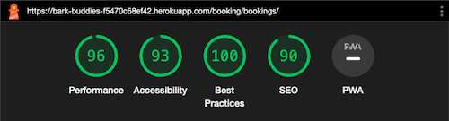

# Testing

## Manual Testing

Throughout the development of BarkBuddies, comprehensive testing was conducted to ensure each feature's functionality before integration into the master branch.

Various user acceptance tests were sent to new users. This aimed to gather feedback from diverse users on different devices and browsers, helping identify and fix issues during development.

|     | User Actions           | Expected Results | Y/N | Comments    |
|-------------|------------------------|------------------|------|-------------|
| Register     |                        |                  |      |             |
| 1           | Click on the Register button | Leads to page with registration form | Y |    Only for logged out users      |
| 2           | Enter valid username | Field will only accept up to 150 characters | Y |  
| 3           | Enter valid email | Field will only accept email address format | Y |          |
| 4           | Leave email field empty | As field is optional, the submission is still accepted | Y |          |
| 5          | Enter valid password | Field will only accept secure passwords | Y |          |
| 6          | Enter valid password confirmation | Field will only accept the same password from the previous field | Y |          |
| 7          | Click on the Register button | Leads user to home page with an alert message confirming successful registration. Register and Login buttons are replaced by My Bookings and Logout buttons. | Y |          |
| 8        | Click on Logout button | Takes user to log out page to confirm logout | Y |          |
| 9          | Click Logout button in the center of the page | Redirects user to home page with alert message confirming successful logout. Register and login buttons appear again. | Y |          |
| Log In      |                        |                  |      |             |
| 1           | Click on the Login button | Leads to page with Login form | Y |  Only for logged out users        |
| 2           | Enter valid username |  Field will only accept up to 150 characters | Y |          |
| 3           | Enter valid password | Field will only accept secure passwords | Y |          |
| 4           | Clicks  the optional “Remember Me” tickbox | Nothing happens right after ticking the box | Y |          |
| 5           | Click on the Login button | Takes user to the same page they have previously been on. User is shown a success alert confirming login. Register and Login buttons are replaced by My Bookings and Logout buttons.  | Y |          |
| 6        | Click on Logout button | Takes user to log out page to confirm logout | Y |          |
| 7          | Click Logout button in the center of the page | Redirects user to home page with alert message confirming successful logout. Register and login buttons appear again. | Y |          |
| Log Out      |                        |                  |      |             |
| 1           | Click on the Logout button | Leads to Log out confirmation page  | Y |      Only visible for logged in users    |
| 2           | Click on “Logout” button on center of the page |   Redirects user to home page with alert message confirming successful logout. Register and login buttons appear again. | 
Menu        |                        |                  |      |             |
| 1           | Click on the "BarkBuddies" logo | Redirection to Home page | Y | Available to everyone |
| 2           | Click on "Home" | Redirection to Home page | Y | Available to everyone |
| 3           | Click on "About" | Leads to About section on Home page | Y | Available to everyone |
| 4           | Click on "Testimonials" | Redirection to Reviews section on Home page | Y | Available to everyone |
| 5           | Click on "Services" | Dropdown menu with available Services appears | Y | Available to everyone |
| 6           | Click on any of the Services from the Dropdown menu | Redirection to Service Detail page | Y |  Available to everyone |
| 7           | Click on "My Bookings" (if logged in) | Redirection to Booking overview page | Y | Available to logged in users |
| Home page |            |                  |      |             |
| 1           |  Click on “Book a Service” button | User is navigated to service section of Home page  | Y |   |
| 2           |  Click on any Service card |  User is redirected to the Service Detail page of that service  | Y |   |
| 3           |  Click on “Want to leave a Review?” | The Review Modal opens | Y |  Available only for logged in users with a past booking.  |
| My Bookings page    |            |                  |      |             |
| 1           |  If Booking available, click on “Cancel” button underneath a Booking | Stay on the same page and an alert appears confirming cancellation. The booking is shown as cancelled with a Re-Book and Delete button. | Y | Available only to logged in users with a booking. Error appears if the user tries to cancel within 24 hours of appointment.  |
| 2           |  If Booking available, click on “Re-Book” button underneath a Booking | Redirect to the Service Detail page where users can place another booking. | Y |  Available only for logged in users with a booking.  |
| 3           |  If Booking cancelled, click on “Re-Book” button underneath a Booking | Redirect to the Service Detail page where users can place another booking. | Y |  Available only for logged in users with a cancelled booking.  |
| 4           |  If Booking cancelled, click on “Delete” button underneath a Booking | Stay on the same page and an alert appears confirming deletion. The booking disappears. If there are no bookings, a message stating that the user has no bookings appears. | Y |  Available only for logged in users with a cancelled booking.  |
| 5           |  If Booking, click on  “Edit” | Edit Booking Page opens. | Y |   |
| 6           |  Click on “Want to leave a Review?” | Review Modal opens. | Y |  Available only for logged in users with a past booking.  |
| Service Detail page |            |                  |      |             |
| 1           |  Click "Book Now" button underneath the Service text | Booking Modal for this Service opens | Y | Available only to logged in users  |
| 2           |  Click "Login to book Service" button underneath the Service text | User is redirected to login and is then redirected back to the Service Detail page. | Y | Only visible if not logged in  |
| 3           |  Click any of the other Service cards underneath | User is redirected to the Service Detail page of that service. | Y |   |
| Edit Booking Page |            |                  |      |             |
| 1           |  Click on “Calendar” Icon to select Start Date | Calendar for selection opens. Paste dates are automatically disabled.  | Y |   |
| 2           |  Click "One Day" checkmark | End date field is filled automatically with the same date as the start date. | Y |   |
| 3           |  Click on “Calendar” Icon to select End Date | Calendar for selection opens. Paste dates are automatically disabled. | Y | Only clickable if One Day check is not ticked.  |
| 4          |  Click on “Time” dropdown to select a timeslot | Dropdown with available times appears and time can be selected. Unavailable times are disabled. | N | Unavailable times are not diaabled, added to unfixed bugs.  |
| 5           |  Enter a comment | Field will only accept up to 400 characters. | Y |   |
| 6           |  Tick checkmark “Add Second Dog” | The total price will automatically change and add 50% of the price. | Y |   |
| 7           |  Click “Close” button | The booking modal closes and the user stays on the Service Detail page. | Y |   |
| 8           |  Click “Book Now” button | The booking modal closes and the user gets a confirmation alert for successful booking, or an error if unsuccessful. The booking is displayed on the page. | Y |   |
| Booking Modal |            |                  |      |             |
| 1           |  Click on “Calendar” Icon to select Start Date | Calendar for selection opens. Paste dates are automatically disabled.  | Y |   |
| 2           |  Click "One Day" checkmark | End date field is filled automatically with the same date as the start date. | Y |   |
| 3           |  Click on “Calendar” Icon to select End Date | Calendar for selection opens. Paste dates are automatically disabled. | Y | Only clickable if One Day check is not ticked.  |
| 4           |  Click on “Calendar” Icon to select End Date | Calendar for selection opens. Paste dates are automatically disabled. | Y | Only clickable if One Day check is not ticked.  |
| 5           |  Click on “Time” dropdown to select a timeslot | Dropdown with available times appears and time can be selected. Unavailable times are disabled. | Y |   |
| 6           |  Enter a comment | Field will only accept up to 400 characters. | Y |   |
| 7           |  Tick checkmark “Add Second Dog” | The total price will automatically change and add 50% of the price. | Y |   |
| 8           |  Click “Close” button | The booking modal closes and the user stays on the Service Detail page. | Y |   |
| 9           |  Click “Book Now” button | The booking modal closes and the user gets a confirmation alert for successful booking, or an error if unsuccessful. The booking is displayed on the page. | Y |   |
| Review Modal  |     |      |     |    |
| 1                | Click Service dropdown | Available Services appear and can be selected | Y |   |
| 2                | Enter a comment into Body field | Field will only accept up to 400 characters. | Y |   |
| 3                | Click “Submit” button | Modal is closed and user sees a success alert for the submitted comment.  | Y |  |
| Footer |            |                  |      |             |
| 1           |  Click on “Our Services” | User is navigated to service section of Home page  | Y |   |
| 2           |  Click on “Testimonials” |  User is redirected to the review section of Home page | Y |   |
| 3           |  Click on “Bookings” | User is redirected to My Bookings page | Y |  Available only for logged in users. Will be redirected to the Login page otherwise. |
| 4           |  Click on Social Links | Social Page is opened in a new Tab. | Y |   |


---

## Testing User Story

| First Time Visitor Goals | Requirements met | Image |
| ------------------------- | --------------- | ----- |
| As a User, I want to see a list of available dog sitting services with details on duration and their respective prices. | Upon visiting the homepage, the user clicks on the “Services” section. The user sees a list of available dog sitting services, complete with duration and pricing details. |  |

| Frequent Visitor Goals    | Requirements met | Image |
| ------------------------- | --------------- | ----- |
| As a user I want to be able to rebook the same service when checking my booking page, so that I don't have to navigate to the service again. | The user logs in and navigates to their My Bookings page and finds the rebook option there. |  |

| Potential Client Goals    | Requirements met | Image |
| ------------------------- | --------------- | ----- |
| As a user, I want to be able to select a specific service and choose the date and time for the dog sitting, ensuring availability for the selected slot. | The user selects a service and then chooses a date and time for the dog sitting. The system ensures the availability of the selected slot before confirming the booking. |  |
| As a user, I want to view a summary of the total cost before confirming my booking, including a breakdown of individual services selected and their respective prices. | Before finalising the booking, the user reviews a summary of total costs. The summary displays a breakdown of the costs. |  |
| As a user, I want the ability to cancel my booking up to 24 hours in advance of the start date without incurring any charges. | The user will see the cancellation option in their booking overview. It will work successfully up til 24 hours of the booking date. |  |
| As a User, I want to be able to choose just one day, instead of a start and end date, as this would save me time in the booking and result in better user experience. | The user has the option to select “One-Day” for the booking which will automatically set the end date to the same date as the start date. |  |

| Pet Sitter (Admin) Goals    | Requirements met | Image |
| ------------------------- | --------------- | ----- |
| As a site owner, I want to make sure that services can only be booked when I am available, this is to make sure that I avoid unneeded cancellations. | The admin can block off dates when they are unavailable, these dates will not be bookable for users. |  |
| As a site owner, I want the ability to cancel bookings on my end, providing flexibility in managing the dog sitting services. | Available in the Admin overview for each Booking |  |
| As a site owner, I want the ability to create new dog sitting services and set their respective prices. | New services and their prices can be added through the admin panel.|  |
| As a site owner, I want to review and approve comments left by users through the admin dashboard. | The comments can be reviewed and approved in the admin panel. |  |
| As a Site Owner I want to disable Services so that I can temporarily take them offline, in case I want to offer the service again at a later stage. | In the Admin overview the Services can be set to Draft status to take them offline. |  |

| Pet Owner (User) Goals    | Requirements met | Image |
| ------------------------- | --------------- | ----- |
| As a user, I expect the system to prevent double bookings for the same date and time, ensuring that a particular time slot is only available if it has not already been booked. | If the user tries to book a timeslot that is already taken, the system prevents the booking by making the time selection unavailable. |  |
| As a user, I want the option to book multiple dogs for dog boarding on the same date, with a limit of 2 dogs. |  The user can select to add a second dog. |  |
| As a user, I want to book dog walks and check-ins only during available time slots, ensuring that the services are scheduled when the dog sitter is available.  |  The user will receive an alert message if the admin sets unavailable dates in the future. Additionally, these dates will not be bookable by the user. |  |

---


## Bugs

### Known bugs

1. Booking should only be allowed from 24 hours in the future onwards. However, if a user chooses tomorrow’s date and a timeslot that should be, in theory, more than 24 hours in the future, it still throws the 24 hours booking error.

    

    

    Until a permanent solution is found, the following was implemented:

- The date of tomorrow will currently be disabled for selection as well.

```
// Set minimum date for the start and end date inputs
function setMinimumDateForBooking() {
   var today = new Date();
   var tomorrow = new Date(today);
   tomorrow.setDate(tomorrow.getDate() + 2);


   var minDate = tomorrow.toISOString().split('T')[0];


   $('#id_start_date').attr('min', minDate);
   $('#id_end_date').attr('min', minDate);
}
```


2. Verified Bug during Validation. The Edit Booking Page does currently not check for booked timeslots, so these are not disabled on selection.

    This is added to future development. 


### Solved bugs

1. [#One Day Booking not working](https://github.com/DietkeSt/bark-buddies/issues/15)

    ***Issue:***

    When I click on the service as a user and choose the start date, tick "One Day" and then select the time and click on "book now", the booking is not confirmed and doesn't lead to the booking overview. When I choose an end date instead of "One Day" then it books successfully

    ***Bug Fix:***

    Due to the End-Date being disabled in the Javascript code, it was not submitted correctly on the form:

    `endDateInput.disabled = true;`

    Changing the endDateInput in the function to Read Only solved the issue:

    ```
    function updateEndDate() {
        if (checkbox.checked && startDateInput.value) {
            endDateInput.value = startDateInput.value;
            endDateInput.readOnly = true;
            checkUnavailableTimes(); // Check for unavailable times
        } else {
            endDateInput.readOnly = false;
        }
    }

    ```

2. [#Unavailable Times are not displayed](https://github.com/DietkeSt/bark-buddies/issues/18)

    ***Issue:***

    As a user I can currently select unavailable times on days where those times are already booked, even though a logic is in place that should disable these time slots.

    ***Bug Fix:***

    The Javascript was not fetching the correct link for checking the unavailable times:

    `/get-unavailable-times/?start_date=${startDate}&end_date=${endDate}`

    Included /booking into the link to fix the error:

    ```
    // Check and update unavailable times
    function checkUnavailableTimes() {
    const startDate = $('#id_start_date').val();
    const endDate = $('#id_end_date').val();


    if (startDate && endDate) {
        fetch(`/booking/get-unavailable-times/?start_date=${startDate}&end_date=${endDate}`)
            .then(response => response.json())
            .then(data => {
                const unavailableTimes = data.unavailable_times;
                updateAvailableTimes(document.getElementById('id_time'), unavailableTimes);
            });
    }
    }
    ```

3. [#Unpublished services visible for user](https://github.com/DietkeSt/bark-buddies/issues/19)

    ***Issue:***

    As a user, I can see all services, even though some of them are unpublished.

    ***Bug Fix:***

    The issue was the HomeView, that displayed all services, no matter the status.
    Adding a query to filter for only published services solved the issue:

    ```
    def get_queryset(self):
        # Return only services that are published
        return Service.objects.filter(status=1)

    ```

4. [#Any user can leave a review](https://github.com/DietkeSt/bark-buddies/issues/20)

    ***Issue:***

    As a user I can leave a review, even when I have not made any bookings in the past.

    ***Bug Fix:***

    Fixed this by checking if user has any bookings in the BookingsView and HomeView:

    `user_has_bookings = Booking.objects.filter(user=request.user, is_cancelled=False).exists()`

    Now, the user can only leave a review with active bookings. To make sure, that the user can only leave a review, if they actually already finished the service, I adjusted the code a bit:

    `user_has_bookings = Booking.objects.filter(user=request.user, end_date__lt=timezone.now(), is_cancelled=False).exists()`

    This ensures that the end_date of the service must have passed, before they can leave a review.

5. [#Booking can be made for past dates](https://github.com/DietkeSt/bark-buddies/issues/21)

    ***Issue:***

    As a user I can currently select past dates to book a service. Instead I should see an error and the booking should not go through.

    ***Bug Fix:***

    Added Javascript for Frontend:

    ```
    function setMinimumDateForBooking() {
        var today = new Date();
        var tomorrow = new Date(today);
        tomorrow.setDate(tomorrow.getDate() + 1); // Set to one day ahead

        var minDate = tomorrow.toISOString().split('T')[0]; // Format as YYYY-MM-DD

        $('#id_start_date').attr('min', minDate);
        $('#id_end_date').attr('min', minDate);
    }
    ```

    This will ensure the past dates cannot be selected.

    For Backend:

    ```
    # Validate the booking date to be at least 24 hours in the future
            if timezone.now() + timedelta(days=1) > timezone.make_aware(datetime.combine(booking_start, datetime.min.time())):
                messages.error(request, 'You must book at least 24 hours in advance.')
                return HttpResponseRedirect(reverse('service_detail', args=[service.slug]))

    ```

    This gives the user a warning message if they did book too early.

---

## Validation

### HTML Validation

1. **No errors** or warnings were found on all HTML pages, except for one, when passing through the official [W3C](https://validator.w3.org/) validator. This checking was done manually by opening the View Source code of each page and then copying and pasting the code into the Direct Input validator.

 - Home Page:
  
    

- Service Page:
  
    

- Bookings Page:
  
    

- Edit Booking Page:
  
    

- Logout Page:
  
    

- Login Page:
  
    
    
- 404 Error Page:
  
    

- 500 Error Page
    

1. **Errors** found on the Registration page, that were related to the generated form. As the following was used, the errors were not fixable directly in the HTML code:

    ```python
    {{ form.as_p }}
    ```

    


### CSS Validation


  No errors or warnings were found when passing through the official [W3C (Jigsaw)](https://jigsaw.w3.org/css-validator/validator.html.en#validate_by_input) validator when using Direct Input. Avoided using checks by URI, because it would show several issues caused by usages of Bootstrap styling. However, CSS works well on various devices and resolutions.


### JS Validation:

No errors or warning messages were found when passing through the official [JSHint](https://www.jshint.com/) validator. 


However, the validator has pointed out the usage of bootstrap and jQuery, but these are needed for the application to work. 

jQuery is used in the application for its simplicity and efficiency in DOM manipulation and event handling, while custom JavaScript is employed to implement specific functionalities and logic that are unique to the application’s requirements, for example setting a minimum date for the booking calendar and handling the navbar scrolling.

The following was added on top of the file to remove these comments:
```
/*jshint esversion: 6 */
/*globals $:false, bootstrap:false */
```


### Python Validation

Validation for the following apps can be found here:

1. barkbuddies:
   
 - [barkbuddies_wsgi](documentation/validation/barkbuddies_wsgi.png)
 - [barkbuddies_asgi](documentation/validation/barkbuddies_asgi.png)
 - [barkbuddies_settings](documentation/validation/barkbuddies_settings.png)
 - [barkbuddies_url](documentation/validation/barkbuddies_url.png)
 - [barkbuddies_views](documentation/validation/barkbuddies_views.png)
 - [barkbuddies_url](documentation/validation/barkbuddies_url.png)

2. booking
 - [booking_views](documentation/validation/booking_views.png)
 - [booking_urls](documentation/validation/booking_urls.png)
 - [booking_models](documentation/validation/booking_models.png)
 - [booking_forms](documentation/validation/booking_forms.png)
 - [booking_apps](documentation/validation/booking_apps.png)
 - [booking_admin](documentation/validation/booking_admin.png)


3. home

 - [home_views](documentation/validation/home_views.png)
 - [home_apps](documentation/validation/home_apps.png)
 - [home_urls](documentation/validation/home_urls.png)


4. reviews
 
 - [reviews_forms](documentation/validation/reviews_forms.png)
 - [reviews_apps](documentation/validation/reviews_apps.png)
 - [reviews_admin](documentation/validation/reviews_admin.png)
 - [review_models](documentation/validation/review_models.png)


No errors were found when the code was passed through the CI Python Linter
 [online validation tool](https://pep8ci.herokuapp.com/#). According to the reports, the code is [Pep 8-compliant](https://legacy.python.org/dev/peps/pep-0008/). This checking was done manually by copying python code and pasting it into the validator.


---

## Lighthouse Report

### Home Page


### Login Page


### Logout Page


### Registration Page


### My Bookings Page




### Edit  Bookings Page


### Service Detail Page


Major issue here is Bootstrap and Slider that are coming from external CSS and Javascript files.


### All Pages

## Compatibility

Testing was conducted on the following browsers;

- Safari;
- Chrome;
- Firefox;

# Responsiveness

- Devtools
- Responsive Viewer
